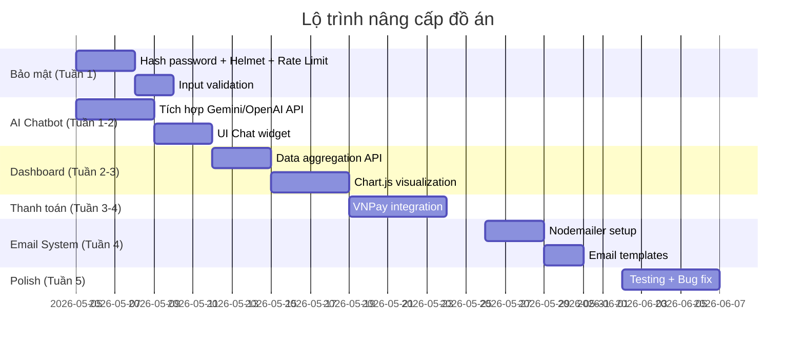

# 🏨 Phân Tích Đồ Án Quản Lý Khách Sạn - Hai Mươi Hotel

> **Sinh viên:** Trần Đức Mạnh | **Đề tài:** Xây dựng Website quản lý khách sạn Hai Mươi Hotel
> **Công nghệ:** Node.js + Express + MongoDB + Handlebars (SSR)

---

## 📊 Tổng Quan Chức Năng Hiện Tại

### Các module đã triển khai (15 usecase)

| # | Module | Chức năng chi tiết | Đánh giá |
|---|--------|--------------------|----------|
| 1 | **Quản lý tài khoản quản trị** | Tạo, sửa, xóa tài khoản admin/staff | ✅ Cơ bản |
| 2 | **Báo cáo thống kê** | Xem thống kê, lọc theo thời gian | ⚠️ Đơn giản |
| 3 | **Đăng nhập/Đăng xuất** | Session-based auth | ⚠️ Thiếu bảo mật |
| 4 | **Quản lý phòng** | CRUD phòng, tìm kiếm, lọc loại phòng/giường | ✅ Đầy đủ |
| 5 | **Quản lý hạng phòng** | CRUD hạng phòng (Standard, Superior, Family) | ✅ Đầy đủ |
| 6 | **Quản lý khách hàng** | Cập nhật, tìm kiếm | ⚠️ Thiếu nhiều |
| 7 | **Quản lý phiếu thuê** | Xác nhận cọc, Check-in, Check-out, sửa, tìm kiếm | ✅ Tốt |
| 8 | **Quản lý dịch vụ** | CRUD, tạm ngưng, tìm kiếm | ✅ Đầy đủ |
| 9 | **Quản lý hóa đơn** | In hóa đơn, tìm kiếm | ⚠️ Cơ bản |
| 10 | **Sơ đồ phòng** | Xem trạng thái real-time, đặt phòng từ sơ đồ | ✅ Tốt |
| 11 | **Quản lý khuyến mãi** | CRUD mã giảm giá | ✅ Đầy đủ |
| 12 | **Đăng ký** | Tạo tài khoản khách hàng | ✅ Cơ bản |
| 13 | **Quản lý tài khoản cá nhân** | Xem lịch sử, đổi mật khẩu | ⚠️ Ít tính năng |
| 14 | **Đặt phòng** | Đặt phòng online, tính phí phụ thu | ✅ Tốt |
| 15 | **Tìm kiếm phòng** | Tìm phòng theo loại | ⚠️ Đơn giản |

### Điểm mạnh hiện tại
- ✅ Socket.IO cho thông báo real-time khi có booking mới
- ✅ Tính phí trả phòng muộn (late checkout fee)
- ✅ Phân quyền admin/staff/user
- ✅ Sơ đồ phòng + Lịch đặt phòng (booking calendar)
- ✅ Hỗ trợ khách vãng lai (walk-in guest)

### Tech Stack hiện tại

```
Frontend: Handlebars (SSR) + SCSS + Vanilla JS
Backend:  Node.js + Express 5
Database: MongoDB + Mongoose
Realtime: Socket.IO
Auth:     Express Session + connect-mongo
Upload:   Multer
```

---

## 🔴 ĐÁNH GIÁ THẲNG THẮN: CÓ ĐƠN GIẢN QUÁ KHÔNG?

> [!CAUTION]
> **CÓ**, so với năm 2026 thì đồ án này **thiếu rất nhiều yếu tố hiện đại**. Các chức năng CRUD cơ bản + đặt phòng + check-in/out là mức **MỞ RỘNG THẤP nhất** của một PMS (Property Management System). Hội đồng chấm có thể đánh giá đây là sản phẩm cấp "bài tập lớn" chứ chưa đạt "đồ án tốt nghiệp 2026".

### Những gì THIẾU hoàn toàn:

| Thiếu | Mức nghiêm trọng | Giải thích |
|-------|:-:|------------|
| **AI / Machine Learning** | 🔴 Critical | Năm 2026, bất kì đồ án nào cũng cần yếu tố AI để nổi bật |
| **Authentication hiện đại** | 🔴 Critical | Không có hash password (bcrypt), không có JWT, không có OAuth |
| **Payment Gateway** | 🟡 High | Không có tích hợp thanh toán online (VNPay, MoMo, ZaloPay) |
| **Email/SMS Notification** | 🟡 High | Không gửi xác nhận, nhắc nhở check-in/out |
| **Dashboard Analytics** | 🟡 High | Report quá đơn giản, thiếu biểu đồ trực quan |
| **Responsive Design / PWA** | 🟡 High | Chưa có mobile-friendly rõ ràng |
| **Multi-language** | 🟠 Medium | Khách sạn cần hỗ trợ ít nhất Anh-Việt |
| **Review & Rating** | 🟠 Medium | Khách hàng không thể đánh giá |
| **API Documentation** | 🟠 Medium | Không có Swagger/OpenAPI |
| **Testing** | 🟠 Medium | Không có bất kỳ test nào |
| **Docker / CI-CD** | 🟢 Low | Nice to have cho đồ án |

---

## 🚀 ĐỀ XUẤT NÂNG CẤP - CHIA THEO MỨC ĐỘ ƯU TIÊN

### 🏆 TIER 1: PHẢI CÓ (Tạo sự khác biệt rõ rệt)

---

#### 1. 🤖 AI Chatbot Hỗ Trợ Khách Hàng
**Tính năng:** Tích hợp chatbot AI (OpenAI/Gemini API) trên trang khách hàng

```
Khách hỏi: "Phòng nào trống ngày 15/6?"
Bot trả lời: "Hiện có 3 phòng Superior trống ngày 15/6. 
              Giá từ 800.000đ/đêm. Bạn muốn đặt phòng ngay không?"
```

**Giá trị đồ án:**
- Thể hiện khả năng tích hợp AI - xu hướng 2026
- Giải quyết bài toán thực tế: giảm tải lễ tân
- Có thể demo trực tiếp trước hội đồng → ấn tượng mạnh

**Công nghệ:** OpenAI API / Google Gemini API + Function Calling

---

#### 2. 💰 Dynamic Pricing (Giá phòng thông minh)
**Tính năng:** Tự động điều chỉnh giá phòng dựa trên:
- Mùa cao điểm / thấp điểm
- Tỷ lệ lấp đầy (occupancy rate)
- Ngày lễ, sự kiện
- Đặt phòng trước bao nhiêu ngày (early bird)

```javascript
// Ví dụ logic
const pricingFactors = {
  weekendMultiplier: 1.3,    // Cuối tuần x1.3
  peakSeasonMultiplier: 1.5, // Cao điểm x1.5
  highOccupancy: 1.2,        // >80% phòng đầy x1.2
  earlyBird: 0.9,            // Đặt trước 30 ngày giảm 10%
};
```

**Giá trị đồ án:**
- Ứng dụng thuật toán → thể hiện tư duy
- Giải quyết bài toán tối ưu doanh thu thực tế
- Hiếm có trong đồ án sinh viên

---

#### 3. 📊 Real-time Dashboard với Data Visualization
**Tính năng:** Dashboard quản trị trực quan thay vì bảng khô khan

```
┌─────────────────────────────────────────────┐
│  📊 DASHBOARD HÔM NAY                       │
│                                              │
│  🏠 Công suất phòng: ████████░░ 78%          │
│  💰 Doanh thu hôm nay: 12,500,000 VNĐ       │
│  📈 So với hôm qua: +15%                    │
│  👥 Check-in hôm nay: 8  │  Check-out: 5    │
│  ⏰ Phòng quá hạn: 2 phòng                  │
│                                              │
│  [Biểu đồ doanh thu 7 ngày] [Pie chart     │
│   loại phòng phổ biến]                       │
└─────────────────────────────────────────────┘
```

**Công nghệ:** Chart.js / ApexCharts + Socket.IO (real-time update)

---

#### 4. 💳 Tích Hợp Thanh Toán Online
**Tính năng:** Cho phép khách thanh toán cọc/full qua cổng thanh toán

| Cổng thanh toán | Phí | Phổ biến |
|-----------------|-----|----------|
| **VNPay** | ~1.1% | ⭐⭐⭐⭐⭐ |
| **MoMo** | ~1.5% | ⭐⭐⭐⭐ |
| **ZaloPay** | ~1.2% | ⭐⭐⭐ |

**Giá trị đồ án:**
- Tính thực tiễn cao
- Thể hiện khả năng tích hợp API bên thứ 3

---

#### 5. 🔐 Nâng Cấp Bảo Mật
**Hiện tại thiếu nghiêm trọng:**

```diff
- Không hash password (lưu plain text?)
- Không có CSRF protection
- Không có rate limiting
- Không validate input server-side đầy đủ
+ Thêm bcrypt cho password hashing
+ Thêm JWT hoặc Passport.js
+ Thêm helmet.js cho HTTP headers
+ Thêm express-rate-limit
+ Thêm express-validator
```

---

### 🥈 TIER 2: NÊN CÓ (Nâng cao điểm đánh giá)

---

#### 6. 📧 Hệ Thống Thông Báo Tự Động
- **Email xác nhận** khi đặt phòng thành công (Nodemailer + Gmail)
- **SMS nhắc nhở** trước ngày check-in 1 ngày
- **Email hóa đơn** sau check-out
- **Push notification** trên trình duyệt (Web Push API)

#### 7. ⭐ Review & Rating System
- Khách đánh giá phòng sau check-out (1-5 sao)
- Hiển thị rating trung bình trên trang đặt phòng
- Admin phản hồi review
- **AI Sentiment Analysis** trên review (bonus điểm!)

#### 8. 🌐 Đa Ngôn Ngữ (i18n)
- Hỗ trợ Tiếng Việt + English
- Sử dụng `i18next` hoặc tự xây dựng
- Auto-detect ngôn ngữ từ browser

#### 9. 📱 Progressive Web App (PWA)
- Cài đặt như app trên điện thoại
- Offline mode cho một số trang
- Push notifications
- Service Worker caching

#### 10. 🔌 Tích Hợp OTA Channels
- Đồng bộ phòng trống với **Booking.com**, **Agoda** (qua API/webhook)
- Tránh overbooking
- Channel Manager đơn giản

---

### 🥉 TIER 3: NICE TO HAVE (Gây ấn tượng thêm)

---

#### 11. 🏠 IoT Integration (Mô phỏng)
- Điều khiển đèn, điều hòa, khóa phòng từ dashboard
- Hiển thị trạng thái thiết bị phòng
- Auto check-out khi khách rời phòng (motion sensor)
- **Lưu ý:** Có thể mô phỏng bằng MQTT + dashboard, không cần phần cứng thật

#### 12. 📄 Xuất Báo Cáo PDF/Excel
- Export báo cáo doanh thu theo tháng/quý
- Export danh sách khách hàng
- Hóa đơn PDF chuyên nghiệp (pdfkit / puppeteer)

#### 13. 🗺️ Google Maps Integration
- Hiển thị vị trí khách sạn trên bản đồ
- Chỉ đường cho khách
- Hiển thị các địa điểm xung quanh

#### 14. 🔍 AI-Powered Search & Recommendation
- Gợi ý phòng phù hợp dựa trên lịch sử đặt phòng
- Smart search: "Phòng 2 người, có ban công, dưới 1 triệu"
- Similar room recommendations

#### 15. 📹 Virtual Room Tour (360°)
- Xem phòng 360° trước khi đặt
- Upload ảnh 360 cho từng phòng
- Tạo trải nghiệm immersive

---

## 🎯 LỘ TRÌNH ĐỀ XUẤT NÂNG CẤP

> [!IMPORTANT]
> **Đừng cố làm tất cả!** Chọn 4-5 tính năng có **impact cao nhất** và làm cho thật tốt.

### Gói đề xuất "Optimal" (4-5 tuần)



### Ưu tiên theo "ROI đồ án" (Điểm / Effort)

| Tính năng | Điểm ấn tượng | Effort | ROI | Ưu tiên |
|-----------|:-:|:-:|:-:|:-:|
| AI Chatbot | ⭐⭐⭐⭐⭐ | 3-4 ngày | 🔥🔥🔥 | **#1** |
| Dashboard Analytics | ⭐⭐⭐⭐ | 4-5 ngày | 🔥🔥🔥 | **#2** |
| Bảo mật (bcrypt, helmet) | ⭐⭐⭐ | 2-3 ngày | 🔥🔥🔥 | **#3** |
| VNPay Payment | ⭐⭐⭐⭐ | 4-5 ngày | 🔥🔥 | **#4** |
| Email Notification | ⭐⭐⭐ | 2-3 ngày | 🔥🔥 | **#5** |
| Dynamic Pricing | ⭐⭐⭐⭐⭐ | 3-4 ngày | 🔥🔥 | **#6** |
| Review & Rating | ⭐⭐⭐ | 3-4 ngày | 🔥 | #7 |
| PWA | ⭐⭐⭐ | 2-3 ngày | 🔥 | #8 |
| Export PDF | ⭐⭐ | 2 ngày | 🔥 | #9 |

---

## 🛠️ GỢI Ý NÂNG CẤP TECH STACK

### Giữ nguyên (không cần thay đổi lớn):

| Thành phần | Giữ | Lý do |
|------------|-----|-------|
| Express.js | ✅ | Stable, đủ dùng |
| MongoDB + Mongoose | ✅ | Phù hợp schema linh hoạt |
| Socket.IO | ✅ | Đã có, tận dụng thêm |

### Thêm mới:

| Package | Mục đích |
|---------|----------|
| `bcryptjs` | Hash password |
| `jsonwebtoken` | JWT auth (optional) |
| `helmet` | Bảo mật HTTP headers |
| `express-rate-limit` | Chống brute force |
| `express-validator` | Validate input |
| `nodemailer` | Gửi email |
| `@google/generative-ai` | Gemini AI Chatbot |
| `vnpay` / `crypto` | Tích hợp VNPay |
| `chart.js` (frontend) | Dashboard charts |
| `pdfkit` | Export PDF |

---

## 💡 LỜI KHUYÊN CUỐI

> [!TIP]
> **Chiến lược khi bảo vệ đồ án:**
> 1. **Demo AI Chatbot live** → Hội đồng hỏi chatbot, chatbot trả lời → WOW factor
> 2. **Show Dashboard real-time** → Kéo dữ liệu biến đổi trên chart → Trực quan
> 3. **Demo thanh toán** → QR scan VNPay sandbox → Tính thực tiễn
> 4. **Nói về bảo mật** → "Em đã implement bcrypt, rate limiting, helmet..." → Chuyên nghiệp

> [!WARNING]
> **Lỗi phổ biến của sinh viên:**
> - Làm QUÁÁÁ nhiều tính năng nhưng cái nào cũng lỏng → Thà làm 5 cái CHẤT
> - Không có AI gì hết trong năm 2026 → Hội đồng sẽ hỏi "Sao không dùng AI?"
> - Giao diện chưa responsive → Mở trên mobile là vỡ

---

**Bạn muốn tôi bắt đầu triển khai tính năng nào trước? Tôi khuyến nghị bắt đầu với:**
1. **Bảo mật** (nền tảng, cần làm trước)
2. **AI Chatbot** (WOW factor cao nhất)
3. **Dashboard Analytics** (trực quan, dễ demo)
